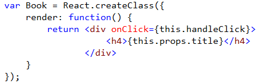
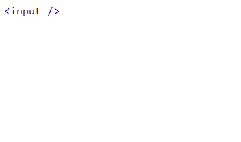

<properties
	pageTitle="Client-side"
	description="Visual Studio has excellent support for many types of client-side frameworks."
	slug="client-side"
	keywords="vsix, extensibility, plugins"
/>

## Apache Cordova
Build cross-platform mobile apps for iOS, Android, and Windows devices using Visual Studio Tools for Apache Cordova. With an extension for Visual Studio 
2013 Update 4 or Visual Studio 2015 Preview, Visual Studio gives you the tools you need to get started building your first app using HTML, CSS, and 
JavaScript based on Apache Cordova.

You can use the extension to build apps for the following devices and platforms: 

- Android 2.3.3 and later (4.4+ provides the best developer experience) 
- iOS 6, 7, and 8
- Windows 8 and 8.1 
- Windows Phone 8 and 8.1 

[Learn more about Apache Cordova in Visual Studio](http://www.visualstudio.com/en-us/explore/cordova-vs.aspx)

## Angular.js
Full [IntelliSense](http://go.microsoft.com/fwlink/?LinkId=532997) for Angular's dependency injection system is supported, as well as HTML properties and template bindings.

## React.js
Full JavaScript editing support with dynamic IntelliSense as well as a brand new editor for JSX syntax.

## Bootstrap CSS
Visual studio makes it easy to identify which classes are coming from the [Bootstrap](http://getbootstrap.com) CSS framework by showing the logo in
the completion list.

## Aurelia
The [Web Essentials](http://vswebessentials.com) extension provides IntelliSense for [Aurelia](http://aurelia.io/)'s HTML properties.

## Knockout.js
Get full IntelliSense for your Knockout view models in HTML data binding expressions.

## Others

- Backbone
- Durandal
- Ionic
- Ember
- Breeze
- ...and many more

<aside role="complementary">

## Related resources

<section>

### More information

- [Apache Cordova](http://cordova.apache.org/)
</section>

<section>

### Relevant extensions

- [Web Essentials](https://visualstudiogallery.msdn.microsoft.com/ee6e6d8c-c837-41fb-886a-6b50ae2d06a2)
- [Glyphfriend](https://visualstudiogallery.msdn.microsoft.com/5fd24afb-b3b2-4cec-9b03-1cfcec6123aa)
- [Bootstrap Snippet Pack](https://visualstudiogallery.msdn.microsoft.com/e82e7862-f731-4183-a27a-3a44b261bfe5)
- [Apache Cordova for Visual Studio 2013](http://www.microsoft.com/en-us/download/details.aspx?id=42675)
- [React Snippet Pack](https://visualstudiogallery.msdn.microsoft.com/234d79e9-f0fd-41e1-a926-850da8e8c7d7)
</section>

</aside>
