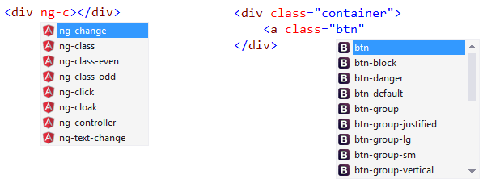

<properties
	pageTitle="Frameworks"
	description="A large number of both client-side and server-side frameworks have first-class support in Visual Studio."
	slug="frameworks"
	order="300"
	keywords="angular, jsx, bootstrap, reactjs, asp.net, django, express"
/>

Visual Studio provides advanced support including [IntelliSense](http://go.microsoft.com/fwlink/?LinkId=532997) for today's most popular web frameworks, such as Angular and Bootstrap.