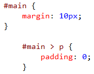

<properties
			pageTitle="CSS"
			description="The new CSS editor in Visual Studio fully supports all versions of CSS including CSS Selectors Level 4."
			slug="css"
			order="400"
			keywords="css, intellisense, stylesheets"
/>

## Auto-completion
Visual Studio [IntelliSense](http://go.microsoft.com/fwlink/?LinkId=532997) is always up-to-date with the latest web standards. You get accurate hints for classes, IDs and attribute names and values, which can sometimes be hard to remember.

## Vendor-specific properties
Vendor-specific selectors and properties are supported for `-moz-*`, `-ms-*`, `-o-*` and `-webkit-*`.

## General snippets
The comprehensive snippet collection makes it easier to write more complex CSS, like gradients, media queries, font-face embedding, and a lot more.

To invoke a snippet, simply hit the `Tab` key after the property name.

## Vendor-specific snippets
All properties that have vendor-specific versions are automatically provided as snippets. Just hit `Tab` to expand the snippet.

## Working with colors
The color picker is an IntelliSense feature that makes it easy to deal with colors. Use the eyedropper to pick colors from other windows, set the opacity, or choose from previously used colors.

## File picker
Working with images, fonts, and other files is easy using
the built-in file picker that automatically helps you insert file
paths into CSS documents.

## Hierarchical indentation
Keep your CSS file nice and organized using hierarchical indentation. The indentation of the CSS rulesets are based on the cascading order of the selectors. to format the document just press `Ctrl+K+D`.

## Auto-sync with BrowserLink
coming soon...

## Open source
The entire [CSS language definition](http://schemastore.org/css) that Visual Studio uses is open source. Find a missing property or pseudo-selector? Send a pull request.