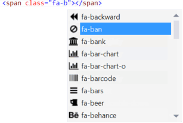

<properties
	pageTitle="HTML"
	description="The HTML editor was completely rewritten in Visual Studio 2013 to create a foundation for great HTML 5 editing experience that is constantly getting better."
	slug="html"
	order="200"
	keywords="html, intellisense, html5, xhtml, autocomplete"
/>

## Basic auto-completion
The HTML editor's up-to-date web standards definitions provide accurate and fast [IntelliSense](http://go.microsoft.com/fwlink/?LinkId=532997) for all elements and attributes. For attributes, IntelliSense lists available values as well as names.

## Match end-tag
Never let your tags get out of sync again when editing. When you edit a tag, Visual Studio automatically updates its corresponding begin or end tag to keep them in sync.

## Classes and IDs
It's easy to forget the names of CSS classes and IDs, so Visual Studio IntelliSense lists them for you as you type. You get all of the classes and IDs that are defined in the current document or in any stylesheet in your project. For example, if you use Bootstrap, IntelliSense shows all of the available Bootstrap classes.

## Dynamic data attributes
When using `data-*` attributes in HTML 5 to store custom data, it can be difficult to remember the various attribute names and their values. Visual Studio automatically keeps track of your `data-*` attributes and gives IntelliSense for both the attribute name and previously used values.

## Wrap with tag
Be more productive by using this handy shortcut to wrap selected text with any element of your choice.

Simply hit `Shift+Alt+W` to wrap the selection.

## Snippets
Snippets provides a shortcut for adding common elements to a page. Visual Studio has built-in snippets for `<video>`, `<audio>`, `<picture>`, and many more. You can create your own snippets as well.

## File picker
The file picker gives you an easy way to add referenes to files in your project. It's smart enough to know what files you would typically use for ``, `<a>`, `<script>`, `<source>` and `<link>` elements, so it automatically filters the list to only show those file types.

## HTML 5 Microdata
It's important to be very accurate when dealing with 
[Microdata](http://html5doctor.com/microdata/). Visual Studio helps you avoid typos by giving IntelliSense for the most common Microdata vocabularies.

## ARIA attributes
IntelliSense lists the choices for ARIA landmarks such as the `role` attribute, as well as for `aria-*` attributes.

## HTML entities
Get quick and easy access to all those HTML entities that are so hard to remember.

## Template syntax
Whether you use Mustache, Handlebars, Angular, or any other double-curly based template language, Visual Studio gives you nice colorization.

## Glyph icons
See the actual glyph icons from all the major CSS icon libraries, including Bootstrap, Font Awesome, Foundation, Ionicons and IcoMoon using the
[Glyphfriend](https://visualstudiogallery.msdn.microsoft.com/5fd24afb-b3b2-4cec-9b03-1cfcec6123aa) extension.

## Quick actions
Light bulbs show up wherever Visual Studio finds opportunities to provide helpers that give you hints about how to solve problems or refactor.

<aside role="complementary">

## Related resources

<section>

### More information

- [HTML 5 specification](http://www.w3.org/TR/html5/)
- [Intro to HTML 5](http://www.w3schools.com/html/html5_intro.asp)
</section>

<section>

### Relevant extensions

- [Web Essentials](https://visualstudiogallery.msdn.microsoft.com/ee6e6d8c-c837-41fb-886a-6b50ae2d06a2)
- [Glyphfriends](https://visualstudiogallery.msdn.microsoft.com/5fd24afb-b3b2-4cec-9b03-1cfcec6123aa)
- [Bootstrap Snippet Pack](https://visualstudiogallery.msdn.microsoft.com/e82e7862-f731-4183-a27a-3a44b261bfe5)
</section>

</aside>