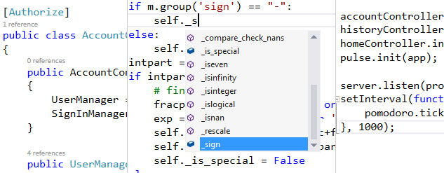

<properties
	pageTitle="Languages"
	description="Visual Studio has support for a wide variety of languages for targeting both the server and client."
	order="200"
	slug="languages"
	keywords="css, html, javascript"
/>

Visual Studio has the best HTML 5, CSS 3, JavaScript, and JSON editor in the world. Tap into the power of LESS, and Sass, use PHP, Python, or C# with ASP.NET,  -- all the popular languages are supported and you can move between languages and project types with ease.  