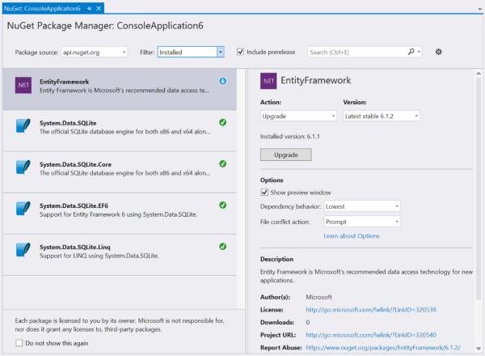
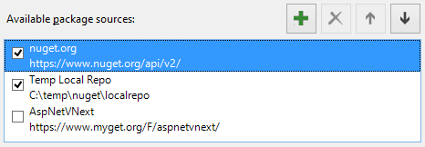

<properties
	pageTitle="NuGet"
	description="The NuGet package manager is ideal for .NET components. With Visual Studio 2015 it is more powerful than ever."
	slug="nuget"
    order="300"
	keywords="nuget, myget, packages"
/>

## IntelliSense
The project.json file lists all of the NuGet package dependencies for ASP.NET 5 applications. The Visual Studio editor gives you full [IntelliSense](http://go.microsoft.com/fwlink/?LinkId=532997) for project.json, including live search results from the online [NuGet registry](http://nuget.org).

## Graphical package management experience
NuGet provides a graphical interface for managing packages. it's easy to get an overview of installed packages, do updates, and discover new packages for your project. 

]

## Package Manager Console
You can use Windows PowerShell with NuGet, and with the Package Manager Console you get the PowerShell experience in Visual Studio.

## IDE integration
The Solution Explorer integrates with NuGet to show a logical tree-view structure of the package dependencies.

## Multiple sources
Add any local or remote package source through the built-in NuGet settings dialog.

<aside role="complementary">

## Related resources

<section>

### More information

- [NuGet.org](http://nuget.org/)
- [Consume NuGet packages](https://docs.nuget.org/consume)
- [Create NuGet packages](http://docs.nuget.org/create/Creating-and-Publishing-a-Package)
</section>

<section>

### Relevant extensions

- [NuGet Packager](https://visualstudiogallery.msdn.microsoft.com/daf5c6db-386b-4994-bdd7-b6cd52f11b72)
- [NuGet References](https://visualstudiogallery.msdn.microsoft.com/e8d1fcad-5fa5-4353-ba9c-90f4b6a68154)
</section>

</aside>