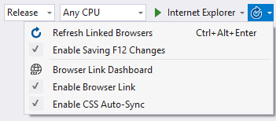
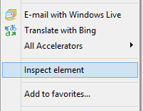

<properties
	pageTitle="Browser Link"
	description="Visual Studio creates a bi-directional web socket channel to any browser or emulator. That socket is called Browser Link."
	slug="browser-link"
	keywords="browserlink, web socket, browsersync"
/>

## JavaScript and Web Sockets
Browser Link is a bi-directional communication channel between Visual Studio and any browser or emulator. It's based on JavaScript and Web Sockets. This feature allows Visual Studio to automatically initiate actions in connected browsers; it can automatically reload the page when you change code that affects the page.  And it works in the other direction; you can make changes in the browser that automatically update code in the Visual Studio project.

## Refresh page
coming soon...

## CSS Auto Sync
coming soon...

## Internet Explorer integration
Internet Explorer's developer tools automatically recognizes when Browser Link is running on a web page. When inspecting an element, Visual Studio will automatically open the source file that generated
that element in the DOM.

