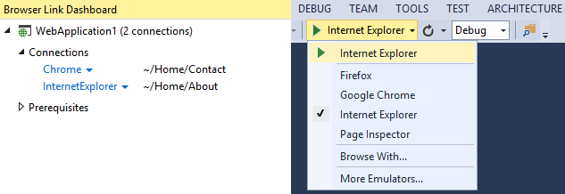

<properties
	pageTitle="Project system"
	description="The project system is the backbone of any web project in Visual Studio."
	slug="project-system"
	order="300"
	keywords="css, html, javascript"
/>

Be more productive with the brand new web project system in Visual Studio 2015, with a simple folder structure. Change code in a web project and Visual Studio automatically updates connected browsers.