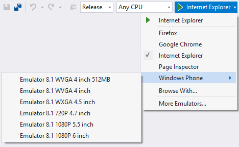

<properties
	       pageTitle="Projects"
	       description="Projects in Visual Studio 2015 are folder-based and don't require the .csproj file to keep track of included files anymore."
	       slug="projects"
	       order="100"
	       keywords="projects, folders, profiles"
/>

## Designed to work with other tools
In Visual Studio 2013 and earlier versions, when working with ASP.NET projects you mostly had to perform tasks inside of Visual Studio. With the new project support for ASP.NET 5, you can use other tools and editors to work on your projects, and Visual Studio respects those changes.

## Folder-based web projects
With ASP.NET 5, all files in your project folder are automatically included as a part of your project. If you use other tools to add files to the project folder structure, you don't need to do anything in Visual Studio to indicate that they should be included in the project. The ASP.NET 5 Visual Studio project file does not keep track of which files are included in the project.

This alleviates the issues with merging projects that you may have run into in the past. And it's a great improvement for web developers, because when developing web applications using client side task runners like Gulp or Grunt, things should just work.

## Run/debug profiles
You can run and debug ASP.NET 5 applications just as you have been able to run and debug ASP.NET projects in previous versions of Visual Studio. In addition, you can now create debug profiles on the Properties page which enable you to configure the startup settings for the project. In debug profiles you can also configure custom environment variables which are used when running or debugging in Visual Studio.

## Browser support
Just like earlier versions of Visual Studio, you can easily start your web application in any browser that is installed by choosing the browser from a dropdown on the toolbar. In addition to browsers, emulators are also available. Visual Studio provides both Windows Phone and Android emulators,but you can install a lot more, including iOS emulators and others.

