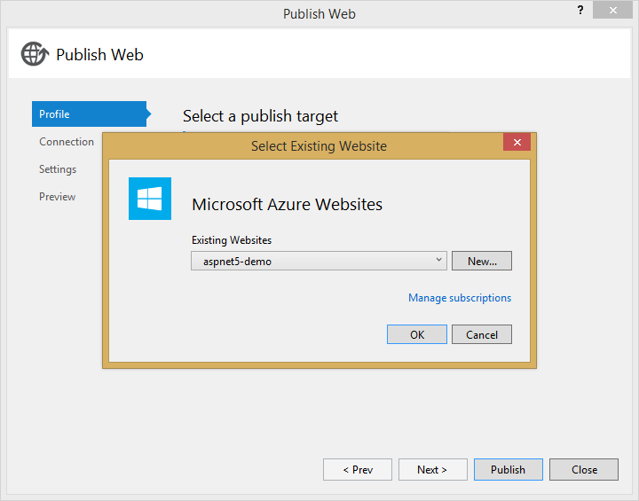
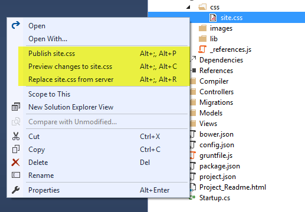

<properties
	pageTitle="Publishing"
	description="Visual Studio 2015 has a web application publishing system that is easy to customize for continuous delivery scenarios."
	slug="publishing"
	keywords="css, html, javascript"
/>

## Azure App Service
Publishing to web apps in Azure App Service has first class support in Visual Studio 2015. You can easily publish to a new or existing site within seconds.

## File system, FTP or Web Deploy
You can easily publish using your choice of protocol -- use Web Deploy, FTP, or copy files to a local or network folder.

## Incremental publishing
After creating a publish profile you can easily publish one or more files directly from Solution Explorer. You can also preview changes before publishing or even download remote files.

## Customizing publishing
Visual Studio 2015 has a new publishing system based on Windows PowerShell. This makes it much easier to customize the publish process. When you create a publish profile, a PowerShell script is added to your project. That is the script that Visual Studio
executes after calling the kpm command line tool to package the application. When the Visual Studio publish process starts the script is called
after the project is packed.