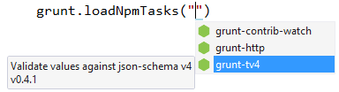

<properties
	pageTitle="Grunt"
	description="Visual Studio has first-class support for the node.js-based Grunt task runner."
	slug="grunt"
	keywords="grunt, gruntjs, grunt.js, task runner"
/>

## IntelliSense for gruntfile.js
You get [auto-completion](http://go.microsoft.com/fwlink/?LinkId=532997) for the `grunt` object as well as for the configuration of Grunt tasks.

The [Web Essentials](http://vswebessentials.com) extension provides auto-completion for loading npm tasks.

## Snippets
Create a new gruntfile.js is easy using the built-in snippet provided by the JavaScript editor. Expand the snippet by typing `grunt` and hitting `Tab`.

## Task Runner Explorer
Use Visual Studio's Task Runner Explorer window to interact with Grunt. Get an overview of your tasks, and execute them directly from within Visual Studio.

## Custom task bindings
Incorporate Grunt tasks into your natural workflow by associating your task with Visual Studio events.

<aside role="complementary">

## Related resources

<section>

### More information

- [Grunt website](http://gruntjs.com/)
- [Managing your build tasks](http://code.tutsplus.com/tutorials/managing-your-build-tasks-with-gulpjs--net-36910)
</section>

<section>

### Relevant extensions

- [Broccoli Task Runner](https://visualstudiogallery.msdn.microsoft.com/dd19e6af-a1f7-4606-a82a-46833f810865)
- [NPM Scripts Task Runner](https://visualstudiogallery.msdn.microsoft.com/8f2f2cbc-4da5-43ba-9de2-c9d08ade4941)
- [Brunch Task Runner](https://visualstudiogallery.msdn.microsoft.com/de706ad0-8a73-4df3-bef5-867bb9a70d51)
- [Web Essentials](https://visualstudiogallery.msdn.microsoft.com/ee6e6d8c-c837-41fb-886a-6b50ae2d06a2)
- [Grunt Launcher](https://visualstudiogallery.msdn.microsoft.com/dcbc5325-79ef-4b72-960e-0a51ee33a0ff)
- [Flatten Packages ](https://visualstudiogallery.msdn.microsoft.com/cd0b1938-4513-4e57-b9b7-c674b4a20e79)
</section>

</aside>